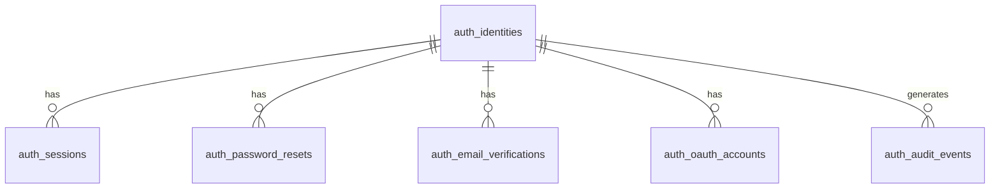

# PostgreSQL Auth Implementation Prompt

You are implementing a production-ready authentication system backed by PostgreSQL with **all business logic in TypeScript application code**. The database holds schema, constraints, and indexes only — no `SECURITY DEFINER` functions, no RLS.

Deliver:

1. TypeScript auth module (types, errors, crypto helpers, service functions)
2. Integration tests for every public function and error path

Do not store raw tokens or plaintext passwords in the database.

---

## Goals

- Registration, login, logout
- Email verification
- Password reset (request + confirm) and password change
- Session management (create, validate, list, revoke)
- Account lockout after repeated failed logins
- Optional OAuth linkage (schema included; implement handlers only if the app already uses OAuth)

Security: Argon2id (preferred) or bcrypt for passwords; SHA-256 hashes for bearer/reset/verification tokens; `crypto.timingSafeEqual` for comparisons; never log tokens or password hashes; identical outward responses for enumeration-prone flows.

---

## Schema (`schema/auth.sql`)

Single file. Use `bigint` for all PKs/FKs — assign IDs in application code or via explicit sequences; no `serial`/`bigserial`/`uuid`. Use `timestamptz` (UTC) and `citext` for email.

```sql
-- schema/auth.sql

CREATE EXTENSION IF NOT EXISTS "citext";

CREATE TYPE auth_identity_status AS ENUM ('pending', 'active', 'suspended', 'deleted');
CREATE TYPE auth_oauth_provider AS ENUM ('google', 'github', 'apple', 'microsoft');

-- ---------------------------------------------------------------------------
-- auth_identities
-- ---------------------------------------------------------------------------

CREATE TABLE auth_identities (
  id                    bigint PRIMARY KEY,
  email                 citext UNIQUE,
  email_verified_at     timestamptz,
  password_hash         text,
  display_name          text,
  avatar_url            text,
  status                auth_identity_status NOT NULL DEFAULT 'pending',
  failed_login_count    int NOT NULL DEFAULT 0 CHECK (failed_login_count >= 0),
  locked_until          timestamptz,
  last_login_at         timestamptz,
  password_changed_at   timestamptz,
  requires_password_change boolean NOT NULL DEFAULT false,
  created_at            timestamptz NOT NULL DEFAULT now(),
  updated_at            timestamptz NOT NULL DEFAULT now(),
  deleted_at            timestamptz,

  -- NOTE: "an identity must have an email OR a linked oauth account" cannot be
  -- expressed as a single-table CHECK (the oauth row lives in another table and
  -- is inserted in the same tx). Enforce that invariant in application code.

  CONSTRAINT auth_identities_active_requires_verified_email
    CHECK (
      status != 'active'
      OR email IS NULL
      OR email_verified_at IS NOT NULL
    )
);

CREATE INDEX auth_identities_status_idx ON auth_identities (status) WHERE deleted_at IS NULL;
CREATE INDEX auth_identities_locked_until_idx ON auth_identities (locked_until) WHERE locked_until IS NOT NULL;

-- ---------------------------------------------------------------------------
-- auth_sessions
-- ---------------------------------------------------------------------------

CREATE TABLE auth_sessions (
  id                bigint PRIMARY KEY,
  identity_id       bigint NOT NULL REFERENCES auth_identities (id) ON DELETE CASCADE,
  token_hash        bytea NOT NULL,
  user_agent        text,
  ip_address        inet,
  expires_at        timestamptz NOT NULL,
  last_active_at    timestamptz NOT NULL DEFAULT now(),
  revoked_at        timestamptz,
  revoke_reason     text,
  created_at        timestamptz NOT NULL DEFAULT now(),

  CONSTRAINT auth_sessions_expires_after_create CHECK (expires_at > created_at)
);

CREATE UNIQUE INDEX auth_sessions_token_hash_uidx ON auth_sessions (token_hash);
CREATE INDEX auth_sessions_identity_id_idx ON auth_sessions (identity_id);
CREATE INDEX auth_sessions_active_idx ON auth_sessions (identity_id, expires_at) WHERE revoked_at IS NULL;
CREATE INDEX auth_sessions_expires_at_idx ON auth_sessions (expires_at) WHERE revoked_at IS NULL;

-- ---------------------------------------------------------------------------
-- auth_password_resets
-- ---------------------------------------------------------------------------

CREATE TABLE auth_password_resets (
  id              bigint PRIMARY KEY,
  identity_id     bigint NOT NULL REFERENCES auth_identities (id) ON DELETE CASCADE,
  token_hash      bytea NOT NULL,
  expires_at      timestamptz NOT NULL,
  used_at         timestamptz,
  requested_ip    inet,
  user_agent      text,
  created_at      timestamptz NOT NULL DEFAULT now(),

  CONSTRAINT auth_password_resets_expires_after_create CHECK (expires_at > created_at),
  CONSTRAINT auth_password_resets_used_after_create CHECK (used_at IS NULL OR used_at >= created_at)
);

CREATE UNIQUE INDEX auth_password_resets_token_hash_uidx ON auth_password_resets (token_hash);
CREATE INDEX auth_password_resets_identity_id_idx ON auth_password_resets (identity_id);
CREATE INDEX auth_password_resets_pending_idx ON auth_password_resets (identity_id, expires_at) WHERE used_at IS NULL;

-- ---------------------------------------------------------------------------
-- auth_email_verifications
-- ---------------------------------------------------------------------------

CREATE TABLE auth_email_verifications (
  id              bigint PRIMARY KEY,
  identity_id     bigint NOT NULL REFERENCES auth_identities (id) ON DELETE CASCADE,
  email           citext NOT NULL,  -- the address being verified; also supports a future email-change re-verification flow (out of scope here)
  token_hash      bytea NOT NULL,
  expires_at      timestamptz NOT NULL,
  verified_at     timestamptz,
  created_at      timestamptz NOT NULL DEFAULT now(),

  CONSTRAINT auth_email_verifications_expires_after_create CHECK (expires_at > created_at)
);

CREATE UNIQUE INDEX auth_email_verifications_token_hash_uidx ON auth_email_verifications (token_hash);
CREATE INDEX auth_email_verifications_identity_id_idx ON auth_email_verifications (identity_id);
CREATE INDEX auth_email_verifications_pending_idx ON auth_email_verifications (identity_id) WHERE verified_at IS NULL;

-- ---------------------------------------------------------------------------
-- auth_oauth_accounts
-- ---------------------------------------------------------------------------

CREATE TABLE auth_oauth_accounts (
  id                        bigint PRIMARY KEY,
  identity_id               bigint NOT NULL REFERENCES auth_identities (id) ON DELETE CASCADE,
  provider                  auth_oauth_provider NOT NULL,
  provider_subject          text NOT NULL,
  provider_email            citext,
  provider_email_verified     boolean,
  profile_raw               jsonb,
  linked_at                 timestamptz NOT NULL DEFAULT now(),
  last_used_at              timestamptz,

  UNIQUE (provider, provider_subject)
);

CREATE INDEX auth_oauth_accounts_identity_id_idx ON auth_oauth_accounts (identity_id);

-- ---------------------------------------------------------------------------
-- auth_audit_events
-- ---------------------------------------------------------------------------

CREATE TABLE auth_audit_events (
  id            bigint PRIMARY KEY,
  identity_id   bigint REFERENCES auth_identities (id) ON DELETE SET NULL,
  event_type    text NOT NULL,
  ip_address    inet,
  user_agent    text,
  metadata      jsonb NOT NULL DEFAULT '{}',
  created_at    timestamptz NOT NULL DEFAULT now()
);

CREATE INDEX auth_audit_events_identity_id_idx ON auth_audit_events (identity_id, created_at DESC);
CREATE INDEX auth_audit_events_event_type_idx ON auth_audit_events (event_type, created_at DESC);

-- ---------------------------------------------------------------------------
-- updated_at trigger (only DB-side logic permitted)
-- ---------------------------------------------------------------------------

CREATE OR REPLACE FUNCTION auth_set_updated_at()
RETURNS trigger AS $$
BEGIN
  NEW.updated_at = now();
  RETURN NEW;
END;
$$ LANGUAGE plpgsql;

CREATE TRIGGER auth_identities_set_updated_at
  BEFORE UPDATE ON auth_identities
  FOR EACH ROW EXECUTE FUNCTION auth_set_updated_at();
```

### Table rules (enforced in application code)

| Table                      | Rule                                                                                                                            |
| -------------------------- | ------------------------------------------------------------------------------------------------------------------------------- |
| `auth_identities`          | `pending` → unverified; `active` → can auth; `suspended` / `deleted` → reject                                                   |
| `auth_sessions`            | TTL 30 days; throttle `last_active_at` updates to once per 5 min                                                                |
| `auth_password_resets`     | TTL 1 hour; invalidate prior unused rows on new request                                                                         |
| `auth_email_verifications` | TTL 24 hours; promote to `active` on verify                                                                                     |
| `auth_oauth_accounts`      | first login creates identity + oauth row + session in one tx                                                                    |
| `auth_audit_events`        | append-only; retention 90 days                                                                                                  |
| `auth_identities`          | every identity must have an `email` **or** a linked oauth account — enforced in app code (no single-table CHECK can express it) |

---

## TypeScript module layout

```
src/auth/
  errors.ts
  types.ts
  crypto.ts
  ids.ts
  config.ts
  audit.ts
  service.ts        # all public functions
  cleanup.ts
  index.ts
```

Use the project's existing DB client (Drizzle, Kysely, `pg`, Prisma raw queries, etc.). Every mutating operation runs inside a transaction.

---

## Errors (`errors.ts`)

All auth errors extend a base class with a stable `code` string for HTTP mapping. Never expose internal details (e.g. "email not found") on enumeration-prone endpoints — throw the generic variant listed below.

```typescript
export type AuthErrorCode =
  | "VALIDATION_ERROR"
  | "EMAIL_ALREADY_EXISTS"
  | "INVALID_CREDENTIALS"
  | "EMAIL_NOT_VERIFIED"
  | "ACCOUNT_SUSPENDED"
  | "ACCOUNT_DELETED"
  | "ACCOUNT_LOCKED"
  | "SESSION_INVALID"
  | "SESSION_EXPIRED"
  | "SESSION_REVOKED"
  | "TOKEN_INVALID"
  | "TOKEN_EXPIRED"
  | "TOKEN_ALREADY_USED"
  | "PASSWORD_TOO_WEAK"
  | "PASSWORD_SAME_AS_CURRENT"
  | "RATE_LIMIT_EXCEEDED"
  | "OAUTH_ACCOUNT_ALREADY_LINKED"
  | "OAUTH_PROVIDER_ACCOUNT_TAKEN"
  | "OAUTH_EMAIL_CONFLICT"
  | "UNAUTHORIZED"
  | "FORBIDDEN"
  | "IDENTITY_NOT_FOUND"
  | "SESSION_NOT_FOUND";

export class AuthError extends Error {
  readonly code: AuthErrorCode;
  readonly statusCode: number;
  readonly expose: boolean; // safe to return message to client

  constructor(code: AuthErrorCode, message: string, statusCode: number, expose = true) {
    super(message);
    this.name = "AuthError";
    this.code = code;
    this.statusCode = statusCode;
    this.expose = expose;
  }
}

// --- 400 ---
export class ValidationError extends AuthError {
  readonly fields: Record<string, string>;

  constructor(message: string, fields: Record<string, string> = {}) {
    super("VALIDATION_ERROR", message, 400);
    this.name = "ValidationError";
    this.fields = fields;
  }
}

export class PasswordTooWeakError extends AuthError {
  constructor() {
    super("PASSWORD_TOO_WEAK", "Password does not meet requirements", 400);
    this.name = "PasswordTooWeakError";
  }
}

export class PasswordSameAsCurrentError extends AuthError {
  constructor() {
    super("PASSWORD_SAME_AS_CURRENT", "New password must differ from current password", 400);
    this.name = "PasswordSameAsCurrentError";
  }
}

// --- 401 ---
export class InvalidCredentialsError extends AuthError {
  constructor() {
    super("INVALID_CREDENTIALS", "Invalid email or password", 401);
    this.name = "InvalidCredentialsError";
  }
}

export class SessionInvalidError extends AuthError {
  constructor() {
    super("SESSION_INVALID", "Session is invalid", 401);
    this.name = "SessionInvalidError";
  }
}

export class SessionExpiredError extends AuthError {
  constructor() {
    super("SESSION_EXPIRED", "Session has expired", 401);
    this.name = "SessionExpiredError";
  }
}

export class SessionRevokedError extends AuthError {
  constructor() {
    super("SESSION_REVOKED", "Session has been revoked", 401);
    this.name = "SessionRevokedError";
  }
}

export class UnauthorizedError extends AuthError {
  constructor(message = "Authentication required") {
    super("UNAUTHORIZED", message, 401);
    this.name = "UnauthorizedError";
  }
}

export class TokenInvalidError extends AuthError {
  constructor() {
    super("TOKEN_INVALID", "Token is invalid", 401);
    this.name = "TokenInvalidError";
  }
}

export class TokenExpiredError extends AuthError {
  constructor() {
    super("TOKEN_EXPIRED", "Token has expired", 401);
    this.name = "TokenExpiredError";
  }
}

export class TokenAlreadyUsedError extends AuthError {
  constructor() {
    super("TOKEN_ALREADY_USED", "Token has already been used", 401);
    this.name = "TokenAlreadyUsedError";
  }
}

// --- 403 ---
export class EmailNotVerifiedError extends AuthError {
  constructor() {
    super("EMAIL_NOT_VERIFIED", "Email address is not verified", 403);
    this.name = "EmailNotVerifiedError";
  }
}

export class AccountSuspendedError extends AuthError {
  constructor() {
    super("ACCOUNT_SUSPENDED", "Account is suspended", 403);
    this.name = "AccountSuspendedError";
  }
}

export class AccountDeletedError extends AuthError {
  constructor() {
    super("ACCOUNT_DELETED", "Account is deleted", 403, false);
    this.name = "AccountDeletedError";
  }
}

export class AccountLockedError extends AuthError {
  readonly lockedUntil: Date;

  constructor(lockedUntil: Date) {
    super("ACCOUNT_LOCKED", "Account is temporarily locked", 403);
    this.name = "AccountLockedError";
    this.lockedUntil = lockedUntil;
  }
}

export class ForbiddenError extends AuthError {
  constructor(message = "Forbidden") {
    super("FORBIDDEN", message, 403);
    this.name = "ForbiddenError";
  }
}

// --- 404 (internal / admin only — never for login/register/reset) ---
export class IdentityNotFoundError extends AuthError {
  constructor() {
    super("IDENTITY_NOT_FOUND", "Identity not found", 404, false);
    this.name = "IdentityNotFoundError";
  }
}

export class SessionNotFoundError extends AuthError {
  constructor() {
    super("SESSION_NOT_FOUND", "Session not found", 404, false);
    this.name = "SessionNotFoundError";
  }
}

// --- 409 ---
export class EmailAlreadyExistsError extends AuthError {
  constructor() {
    // On public register endpoint, catch and return generic 200/201 instead
    super("EMAIL_ALREADY_EXISTS", "Email is already registered", 409, false);
    this.name = "EmailAlreadyExistsError";
  }
}

export class OAuthAccountAlreadyLinkedError extends AuthError {
  constructor() {
    super("OAUTH_ACCOUNT_ALREADY_LINKED", "OAuth account is already linked to this identity", 409);
    this.name = "OAuthAccountAlreadyLinkedError";
  }
}

export class OAuthProviderAccountTakenError extends AuthError {
  constructor() {
    super("OAUTH_PROVIDER_ACCOUNT_TAKEN", "This provider account is linked to another user", 409);
    this.name = "OAuthProviderAccountTakenError";
  }
}

export class OAuthEmailConflictError extends AuthError {
  constructor() {
    // OAuth profile email already belongs to an existing identity.
    // Do not auto-link (takeover risk) and do not create a duplicate.
    super(
      "OAUTH_EMAIL_CONFLICT",
      "An account with this email already exists; sign in and link the provider instead",
      409,
      false,
    );
    this.name = "OAuthEmailConflictError";
  }
}

// --- 429 ---
export class RateLimitExceededError extends AuthError {
  readonly retryAfterSeconds: number;

  constructor(retryAfterSeconds: number) {
    super("RATE_LIMIT_EXCEEDED", "Too many requests", 429);
    this.name = "RateLimitExceededError";
    this.retryAfterSeconds = retryAfterSeconds;
  }
}

export function isAuthError(err: unknown): err is AuthError {
  return err instanceof AuthError;
}
```

### Error → HTTP mapping (enumeration-safe)

| Endpoint                        | Throw internally          | Return to client                                                                              |
| ------------------------------- | ------------------------- | --------------------------------------------------------------------------------------------- |
| `login`                         | any auth failure          | always `InvalidCredentialsError` (401) — except `AccountLockedError` (403 with `lockedUntil`) |
| `register`                      | `EmailAlreadyExistsError` | generic success message (no leak)                                                             |
| `requestPasswordReset`          | anything                  | always `{ ok: true }`                                                                         |
| `verifyEmail` / `resetPassword` | token errors              | `TokenInvalidError` (401) for invalid/expired/used                                            |

---

## Types (`types.ts`)

```typescript
export type AuthIdentityStatus = "pending" | "active" | "suspended" | "deleted";
export type AuthOAuthProvider = "google" | "github" | "apple" | "microsoft";

export type AuthIdentity = {
  id: bigint;
  email: string | null;
  emailVerifiedAt: Date | null;
  displayName: string | null;
  avatarUrl: string | null;
  status: AuthIdentityStatus;
  failedLoginCount: number;
  lockedUntil: Date | null;
  lastLoginAt: Date | null;
  passwordChangedAt: Date | null;
  requiresPasswordChange: boolean;
  createdAt: Date;
  updatedAt: Date;
  deletedAt: Date | null;
};

export type AuthSession = {
  id: bigint;
  identityId: bigint;
  userAgent: string | null;
  ipAddress: string | null;
  expiresAt: Date;
  lastActiveAt: Date;
  revokedAt: Date | null;
  revokeReason: string | null;
  createdAt: Date;
};

export type RequestContext = {
  ipAddress?: string;
  userAgent?: string;
};

export type RegisterInput = {
  email: string;
  password: string;
  displayName?: string;
};

export type RegisterResult = {
  identityId: bigint;
  verificationToken: string; // raw — send via email, never persist
};

export type LoginInput = {
  email: string;
  password: string;
};

export type LoginResult = {
  sessionId: bigint;
  sessionToken: string; // raw — set cookie, never persist
  identity: PublicIdentity;
};

// `requiresPasswordChange` is included so the client can render a forced
// change-password UI after login / on session validation.
export type PublicIdentity = Pick<
  AuthIdentity,
  | "id"
  | "email"
  | "displayName"
  | "avatarUrl"
  | "status"
  | "emailVerifiedAt"
  | "requiresPasswordChange"
>;

export type SessionValidationResult = {
  sessionId: bigint;
  identity: PublicIdentity;
};

export type PasswordResetRequestResult = {
  ok: true;
  resetToken?: string; // present only when identity exists — pass to mailer, never log
};

export type OAuthProfile = {
  provider: AuthOAuthProvider;
  subject: string;
  email?: string;
  emailVerified?: boolean;
  displayName?: string;
  avatarUrl?: string;
  raw?: Record<string, unknown>;
};
```

---

## Config (`config.ts`)

```typescript
export type AuthConfig = {
  sessionTtlMs: number; // default 30 days
  sessionActiveThrottleMs: number; // default 5 min
  emailVerificationTtlMs: number; // default 24 h
  passwordResetTtlMs: number; // default 1 h
  maxFailedLogins: number; // default 5
  lockoutDurationMs: number; // default 15 min
  passwordResetRateLimit: number; // default 3 per hour per email
  auditRetentionMs: number; // default 90 days
  argon2: { memoryKiB: number; iterations: number; parallelism: number };
  // or bcryptCost: number
};
```

---

## Crypto & IDs (`crypto.ts`, `ids.ts`)

```typescript
// crypto.ts
export function hashPassword(plain: string): Promise<string>;
export function verifyPassword(plain: string, hash: string): Promise<boolean>;
export function generateToken(): string; // 32 random bytes → base64url
export function hashToken(token: string): Buffer; // SHA-256
export function timingSafeEqual(a: Buffer, b: Buffer): boolean;

// abs(int64) - // not uint64 because postgres does not support that
export function randomInt64Id(): bigint;
```

---

## Audit (`audit.ts`)

```typescript
export type AuditEventType =
  | "register"
  | "email_verified"
  | "login_success"
  | "login_failure"
  | "logout"
  | "session_revoked"
  | "password_reset_requested"
  | "password_reset_completed"
  | "password_changed"
  | "password_change_required"
  | "account_locked"
  | "account_restored"
  | "oauth_linked"
  | "oauth_login";

export function recordAuditEvent(
  tx: DbTransaction,
  event: {
    identityId?: bigint;
    eventType: AuditEventType;
    ctx?: RequestContext;
    metadata?: Record<string, unknown>;
  },
): Promise<void>;
```

---

## Application functions (`service.ts`)

Implement every function below. Signatures are the contract — fill in SQL via the project's DB layer.

### `register(input: RegisterInput, ctx?: RequestContext): Promise<RegisterResult>`

1. Validate email format and password strength → `ValidationError` / `PasswordTooWeakError`
2. Normalize email (lowercase; DB `citext` handles case)
3. In transaction:
   - If non-deleted identity with email exists → throw `EmailAlreadyExistsError` (caller maps to generic response)
   - Insert `auth_identities` (`id = randomInt64Id()`, `status = 'pending'`, hash password, `password_changed_at = now()`)
   - Generate verification token; insert `auth_email_verifications`
   - `recordAuditEvent({ eventType: 'register' })`
4. Return `{ identityId, verificationToken }`

### `verifyEmail(token: string, ctx?: RequestContext): Promise<PublicIdentity>`

1. `tokenHash = hashToken(token)`
2. Load verification by `token_hash` → not found: `TokenInvalidError`
3. `verified_at` set → `TokenAlreadyUsedError`
4. `expires_at < now()` → `TokenExpiredError`
5. In transaction:
   - Set `verified_at`, `auth_identities.email_verified_at`, `status = 'active'`
   - `recordAuditEvent({ eventType: 'email_verified' })`
6. Return public identity

### `login(input: LoginInput, ctx?: RequestContext): Promise<LoginResult>`

Enumeration policy: every failure returns `InvalidCredentialsError` except an active lockout, which returns `AccountLockedError`. Do **not** reveal `pending` / `suspended` / `deleted` status here.

1. Validate input → `ValidationError`
2. Load identity by email
3. If no identity OR no `password_hash`: run `verifyPassword` against a dummy hash (timing leak prevention), then `InvalidCredentialsError`
4. If `locked_until > now()` → `AccountLockedError` (the one distinct outcome)
5. Verify password. If wrong:
   - Increment `failed_login_count`; if `>= maxFailedLogins`, set `locked_until`, audit `account_locked`
   - Audit `login_failure`
   - `InvalidCredentialsError`
6. If `status !== 'active'` (i.e. `pending` / `suspended` / `deleted`, or `deleted_at` set) → `InvalidCredentialsError` (no status leak)
7. On success (transaction):
   - Reset `failed_login_count`, clear `locked_until`, set `last_login_at`
   - Create session (`token_hash`, `expires_at`, `user_agent`, `ip_address`)
   - Audit `login_success`
8. Return `{ sessionId, sessionToken, identity }`. `requires_password_change` does **not** block login — it is surfaced on `identity.requiresPasswordChange` so the client can immediately render a forced change-password UI.

> `EmailNotVerifiedError` / `AccountSuspendedError` are intentionally **not** thrown by `login`. Surface "verify your email" via a separate authenticated/resend-verification endpoint, never on the login path.

> **Forced password change**: when `requiresPasswordChange` is `true`, the session is fully valid but should be treated as restricted. The client must route the user to change-password; for defense in depth, server middleware may reject every other state-changing route (returning `ForbiddenError`) until `changePassword` clears the flag. Enforcement scope (client-only vs. server-enforced) is an app decision — document whichever you pick.

### `validateSession(sessionToken: string, ctx?: RequestContext): Promise<SessionValidationResult>`

1. Load session by `hashToken(sessionToken)`
2. Not found → `SessionInvalidError`
3. `revoked_at` set → `SessionRevokedError`
4. `expires_at < now()` → `SessionExpiredError`
5. Load identity; `status !== 'active'` or deleted → `SessionInvalidError`
6. If `now() - last_active_at > sessionActiveThrottleMs`, update `last_active_at` (a single-row, best-effort write — the one mutation exempt from the "every mutation in a transaction" rule)
7. Return `{ sessionId, identity }` — `identity.requiresPasswordChange` is carried through so middleware/clients can enforce the forced change-password flow on every request, not just at login

### `logout(sessionToken: string, ctx?: RequestContext): Promise<void>`

1. `validateSession` optional — if invalid, no-op (idempotent)
2. Set `revoked_at = now()`, `revoke_reason = 'logout'`
3. Audit `logout`

### `listSessions(identityId: bigint, currentSessionId?: bigint): Promise<(AuthSession & { current: boolean })[]>`

1. Return active sessions for identity (`revoked_at IS NULL`, `expires_at > now()`), ordered by `last_active_at DESC`
2. Mark `current: true` when `id === currentSessionId`

### `revokeSession(identityId: bigint, sessionId: bigint, reason?: string): Promise<void>`

1. Load session; must belong to `identityId` → else `SessionNotFoundError`
2. Already revoked → no-op
3. Set `revoked_at`, `revoke_reason = reason ?? 'user_revoke'`
4. Audit `session_revoked`

### `revokeAllSessions(identityId: bigint, reason: string, exceptSessionId?: bigint): Promise<number>`

1. Revoke all active sessions for identity, optionally keeping `exceptSessionId`
2. Return count revoked
3. Audit `session_revoked` per session or once with `{ count }` metadata

### `requestPasswordReset(email: string, ctx?: RequestContext): Promise<PasswordResetRequestResult>`

1. Check rate limit for email → `RateLimitExceededError`
2. Load active identity by email
3. If not found: return `{ ok: true }` (no token). Keep response timing for this branch comparable to the found branch (e.g. do the token/insert/mail work after responding, or otherwise avoid a measurable timing gap) so the endpoint can't be used to enumerate emails
4. In transaction:
   - Mark all pending resets for identity `used_at = now()`
   - Insert new `auth_password_resets`
   - Audit `password_reset_requested`
5. Return `{ ok: true, resetToken }`

### `completePasswordReset(token: string, newPassword: string, ctx?: RequestContext): Promise<void>`

1. Validate password → `PasswordTooWeakError`
2. Load reset by `hashToken(token)` → `TokenInvalidError` if missing
3. `used_at` set → `TokenAlreadyUsedError`
4. `expires_at < now()` → `TokenExpiredError`
5. In transaction:
   - Set `used_at`, update identity `password_hash`, `password_changed_at`, reset `failed_login_count`, clear `requires_password_change = false`
   - `revokeAllSessions(identityId, 'password_change')`
   - Audit `password_reset_completed`

### `changePassword(identityId: bigint, currentPassword: string, newPassword: string, currentSessionId?: bigint, ctx?: RequestContext): Promise<void>`

1. Load identity → `IdentityNotFoundError`
2. No `password_hash` (OAuth-only) → `ForbiddenError`
3. Wrong current password → `InvalidCredentialsError`
4. `newPassword` same as current → `PasswordSameAsCurrentError`
5. Weak new password → `PasswordTooWeakError`
6. In transaction:
   - Update `password_hash`, `password_changed_at`, clear `requires_password_change = false`
   - `revokeAllSessions(identityId, 'password_change', currentSessionId)` — keeps the caller's own session alive when `currentSessionId` is supplied
   - Audit `password_changed`

### `getIdentity(identityId: bigint): Promise<PublicIdentity>`

1. Load identity → `IdentityNotFoundError`
2. Return public fields

### `restoreIdentity(identityId: bigint, ctx?: RequestContext): Promise<PublicIdentity>`

> Admin-only. A soft-deleted email stays `UNIQUE` and can never re-register, so this is the only path back. Caller must enforce admin authorization.

1. Load identity → `IdentityNotFoundError`
2. If `status !== 'deleted'` (and `deleted_at IS NULL`) → no-op; return current public identity
3. In transaction:
   - Clear `deleted_at`; set `status = 'active'` when `email_verified_at IS NOT NULL`, else `'pending'`
   - Audit `account_restored`
4. Return public identity

### `setRequiresPasswordChange(identityId: bigint, required: boolean, ctx?: RequestContext): Promise<void>`

> Admin / system-only. Sets the forced-change flag — e.g. after issuing a temporary password, on a detected compromise, or per a password-age policy. The flag is cleared automatically by `changePassword` / `completePasswordReset`.

1. Load identity → `IdentityNotFoundError`
2. In transaction:
   - Set `requires_password_change = required`
   - Audit `password_change_required` (metadata `{ required }`)

### `loginWithOAuth(profile: OAuthProfile, ctx?: RequestContext): Promise<LoginResult>`

1. Load `auth_oauth_accounts` by `(provider, subject)`
2. If exists: load identity, validate `status === 'active'`, create session, update `last_used_at`, audit `oauth_login`
3. If not exists:
   - If `profile.email` is present and a non-deleted identity already has that email → throw `OAuthEmailConflictError` (do not auto-link; the user must sign in and call `linkOAuthAccount`)
   - In transaction:
     - Create `auth_identities`. Set `active` if `profile.emailVerified`, else `pending`. When creating `active` **with an email**, also set `email_verified_at = now()` (required by the `auth_identities_active_requires_verified_email` CHECK)
     - Create `auth_oauth_accounts`
     - Create session
     - Audit `oauth_login`
4. Throw `AccountSuspendedError` / `AccountDeletedError` as appropriate

### `linkOAuthAccount(identityId: bigint, profile: OAuthProfile, ctx?: RequestContext): Promise<void>`

1. Caller must already be authenticated as `identityId`
2. If `(provider, subject)` exists on another identity → `OAuthProviderAccountTakenError`
3. If already linked to same identity → `OAuthAccountAlreadyLinkedError`
4. Insert `auth_oauth_accounts`; audit `oauth_linked`

---

## Housekeeping (`cleanup.ts`)

```typescript
export async function cleanupExpiredAuthRecords(db: Db): Promise<{
  sessions: number;
  passwordResets: number;
  emailVerifications: number;
  auditEvents: number;
}>;
```

Delete:

- Sessions: `expires_at < now() - 7d` OR `revoked_at < now() - 30d`
- Password resets: used > 7d ago OR unused and expired > 1d ago
- Email verifications: verified > 7d ago OR unverified expired > 1d ago
- Audit events: `created_at < now() - auditRetentionMs`

Run on a cron schedule.

---

## Application security contract

| Concern               | Requirement                                                                                                                                                                                                                                       |
| --------------------- | ------------------------------------------------------------------------------------------------------------------------------------------------------------------------------------------------------------------------------------------------- |
| Password hashing      | Argon2id: 64MB, 3 iterations, parallelism 4 — or bcrypt cost ≥ 12. Tune `parallelism` to available cores (OWASP baseline is p=1); 4 assumes ≥4 cores                                                                                              |
| Token generation      | `crypto.randomBytes(32)` → base64url; store `SHA-256(token)` as `bytea`                                                                                                                                                                           |
| Session cookie        | `HttpOnly`, `Secure`, `SameSite=Lax`, name e.g. `sid`                                                                                                                                                                                             |
| CSRF                  | On state-changing cookie-authenticated routes                                                                                                                                                                                                     |
| Constant-time compare | Tokens are looked up **by** `token_hash` via the unique index (a 256-bit-preimage secret, so index-lookup timing is not exploitable). Use `timingSafeEqual` only for in-code byte comparisons (e.g. the login dummy-hash path), not the DB lookup |

---

## Test checklist

- [ ] `register` → `verifyEmail` → `login` → `validateSession` → `logout`
- [ ] Duplicate register → `EmailAlreadyExistsError` (endpoint returns generic success)
- [ ] Login wrong password increments `failed_login_count`
- [ ] Fifth failure → `AccountLockedError`; login blocked until expiry
- [ ] `requestPasswordReset` unknown email returns `{ ok: true }` without token
- [ ] `completePasswordReset` revokes all sessions
- [ ] Used/expired reset token → correct error class
- [ ] Expired/revoked session → correct error class
- [ ] `changePassword` revokes other sessions
- [ ] `revokeSession` forbidden for another user's session
- [ ] OAuth link conflicts → `OAuthProviderAccountTakenError`
- [ ] `loginWithOAuth` with email matching an existing identity → `OAuthEmailConflictError` (no duplicate identity, no auto-link)
- [ ] Login on `pending` / `suspended` / `deleted` account → `InvalidCredentialsError` (no status leak); only active lockout → `AccountLockedError`
- [ ] `restoreIdentity` on a soft-deleted account clears `deleted_at` and restores `active`/`pending` by verified-email state
- [ ] `setRequiresPasswordChange(true)` → `login` / `validateSession` return `identity.requiresPasswordChange === true`; `changePassword` (and `completePasswordReset`) clear it back to `false`
- [ ] `cleanupExpiredAuthRecords` does not delete active sessions

---

## Deliverables

1. `schema/auth.sql` — single schema file (above)
2. `src/auth/**` — errors, types, crypto, service functions
3. Tests — every function + every error path
4. Dev seed — one `active` user, one `pending` user, one `active` user with `requires_password_change = true`
5. HTTP route handlers wiring to service functions (if the project has a web layer)

---

## Example HTTP routes

```
POST   /auth/register
POST   /auth/verify-email
POST   /auth/login
POST   /auth/logout
GET    /auth/me
POST   /auth/password/forgot
POST   /auth/password/reset
POST   /auth/password/change
GET    /auth/sessions
DELETE /auth/sessions/:id
```

---

## ER diagram



---

## Implementation notes

1. Match existing repo patterns for DB access, DI, and testing before writing files.
2. `auth_identities` is the source of truth — app profiles FK to `auth_identities.id`.
3. No RLS. No Postgres business-logic functions. One schema file only.
4. OAuth handlers: implement only if the project already has an OAuth client.
5. Ask before adding dependencies not already in the project.
6. Most PG drivers marshal `bigint` columns as JS `string` by default. Configure the driver's type parser (e.g. `pg-types`) so IDs round-trip as `bigint`, matching the TS types — otherwise you'll hit `string`/`bigint` mismatches on FKs and comparisons.
